# 体系结构仿真实验一

## MIPS指令集

### R型指令：


R型指令用于寄存器之间的操作，如加减乘除等，指令格式中的操作码为000000。
这种指令涉及到寄存器之间的操作，使用3个寄存器进行操作。这些指令的操作码字段为6位，rs、rt、rd、shamt和funct字段的长度为5位。
其中，rs、rt分别表示源寄存器1和源寄存器2，rd表示目标寄存器，shamt字段用于移位操作，funct字段指定具体的操作类型。

在本实验中需要实现的R型指令有：SLL（逻辑左移）、SRL（逻辑右移）、SRA（算术右移）、SLLV（逻辑左移）、SRLV（逻辑右移）、SRAV（算术右移）、JR（无条件跳转）、JALR（函数调用）、MFHI（乘法结果的高32位）、MTHI（将乘法运算结果的高32位存储在HI寄存器中）、MFLO（将乘法运算结果的低32位存储在目标寄存器中）、MTLO（将一个寄存器中的值移动到LO寄存器中）、MULT（有符号整数乘法）、MULTU（无符号整数乘法）、DIV（有符号整数除法）、DIVU（无符号整数除法）、ADD（加法）、ADDU（无符号加法）、SUB（减法）、SUBU（无符号减法）、AND（按位逻辑与）、OR（按位逻辑或）、XOR（按位逻辑异或）、NOR（按位逻辑或非）、SLT（有符号小于置位）、SLTU（无符号小于置位）

> SLL（逻辑左移） - op：0 - funct：0x00
> SRL（逻辑右移） - op：0 - funct：0x02
> SRA（算术右移） - op：0 - funct：0x03
> SLLV（逻辑左移变量） - op：0 - funct：0x04
> SRLV（逻辑右移变量） - op：0 - funct：0x06
> SRAV（算术右移变量） - op：0 - funct：0x07
> JR（无条件跳转） - op：0 - funct：0x08
> JALR（函数调用） - op：0 - funct：0x09
> SYSCALL（系统调用） - op：0 - funct：0x0c
> MFHI（将HI寄存器的值移动到目标寄存器） - op：0 - funct：0x10
> MTHI（将源寄存器的值移动到HI寄存器） - op：0 - funct：0x11
> MFLO（将LO寄存器的值移动到目标寄存器） - op：0 - funct：0x12
> MTLO（将源寄存器的值移动到LO寄存器） - op：0 - funct：0x13
> MULT（有符号整数乘法） - op：0 - funct：0x18
> MULTU（无符号整数乘法） - op：0 - funct：0x19
> DIV（有符号整数除法） - op：0 - funct：0x1a
> DIVU（无符号整数除法） - op：0 - funct：0x1b
> ADD（有符号整数加法） - op：0 - funct：0x20
> ADDU（无符号整数加法） - op：0 - funct：0x21
> SUB（有符号整数减法） - op：0 - funct：0x22
> SUBU（无符号整数减法） - op：0 - funct：0x23
> AND（按位逻辑与） - op：0 - funct：0x24
> OR（按位逻辑或） - op：0 - funct：0x25
> XOR（按位逻辑异或） - op：0 - funct：0x26
> NOR（按位逻辑或非） - op：0 - funct：0x27
> SLT（有符号小于置位） - op：0 - funct：0x2a
> SLTU（无符号小于置位） - op：0 - funct：0x2b

### I型计算类指令：


其中，操作码表示指令的具体操作，第一个操作数寄存器和目标寄存器表示指令中涉及的寄存器编号，立即数表示指令中涉及的立即数的值。在MIPS指令集中，I型计算类指令的操作码通常为6位，rs和rt字段各占5位，imm字段占16位。

I型计算类指令是指立即数计算类指令，其操作码为6位，rs字段代表第一个操作数寄存器，rt字段代表第二个操作数寄存器，立即数字段表示立即数操作数。这类指令执行时，先将第一个操作数从寄存器中取出，再将立即数或者第二个操作数从寄存器中取出，经过计算后将结果存储到目标寄存器中。

### I型取数类指令：


I型指令用于取数和存数操作，立即数可以是有符号数或无符号数，操作码根据不同指令而不同。
这种指令涉及到立即数的操作，使用2个寄存器和一个立即数进行操作。这些指令的操作码字段为6位，rs、rt字段的长度为5位，immediate字段的长度为16位。
其中，rs表示源寄存器，rt表示目标寄存器，immediate表示立即数。

### I型条件判断类指令：


这种指令涉及到条件分支的操作，使用1个寄存器和一个偏移量进行操作。这些指令的操作码字段为6位，rs、rt字段的长度为5位，offset字段的长度为16位。其中，rs表示源寄存器，offset表示偏移量，根据rs中的值进行条件分支操作。

在本实验中需要实现的I型指令有：ADDI（立即数加法）、ADDIU（无符号立即数加法）、ANDI（与立即数按位与）、ORI（与立即数按位或）、XORI（与立即数按位异或）、LUI（低位加载）、LB（加载一个字节）、LBU（加载一个字节零扩展）、LH（加载一个半字（16位）的数据）、LHU（加载一个半字（16位）的数据零扩展）、LW（加载一个字（32位）的数据）、SB（将一个字节的数据写入内存）、SH（将一个半字（16位）的数据写入内存）、SW（将一个字（32位）的数据写入内存）、BLTZ（小于零）、BLTZAL（返回地址保存）、BGEZ（否大于或等于零）、BGEZAL（返回地址保存）、BNE（不相等）、BLEZ（小于等于零）、BGTZ（大于零）。

> ADDI（立即数加法） op：0x8
> ADDIU（无符号立即数加法） op：0x9
> ANDI（与立即数按位与） op：0xC
> ORI（或立即数按位或） op：0xD
> XORI（异或立即数按位异或） op：0xE
> LUI（加载上半字立即数） op：0xF
> LB（加载一个字节） op：0x20
> LBU（加载一个字节零扩展） op：0x24
> LH（加载一个半字（16位）的数据） op：0x21
> LHU（加载一个半字（16位）的数据零扩展） op：0x25
> LW（加载一个字（32位）的数据） op：0x23
> SB（将一个字节的数据写入内存） op：0x28
> SH（将一个半字（16位）的数据写入内存） op：0x29
> SW（将一个字（32位）的数据写入内存） op：0x2B
> BLTZ（小于零） op：0x1
> BLTZAL（小于零并保存返回地址） op：0x1
> BGEZ（大于或等于零） op：0x1
> BGEZAL（大于或等于零并保存返回地址） op：0x1
> BNE（不相等） op：0x5
> BLEZ（小于等于零） op：0x6
> BGTZ（大于零） op：0x7

### J型指令：


在本实验中需要实现的J型指令有：J（无条件跳转）、JAL（跳转并链接，将返回地址存储在寄存器中）。

> J（无条件跳转） op：0x2
> JAL（跳转并链接，将返回地址存储在寄存器中） op：0x3

### 特权指令：

特权指令是MIPS指令集中用于操作特权级别的指令。这些指令只能由特权级别较高的程序执行，并且可以用于访问系统资源或执行特定的操作。

在本实验中需要实现的特权指令有：SYSCALL（系统调用）

> SYSCALL（系统调用） op：0 	funct：0xc

## 程序设计

因为不同指令的op、funct等各个部分的取值各不相同，所有我们选择使用switch语句以此缩小指令范围，从而匹配正确且唯一的MIPS指令，再实现其具体功能。

如对于DIV指令，我们通过op划分R、I、J型指令，当op=0时通常表示R型指令，再进一步由funct的值我们可以准确定位到DIV上。同理，对于ADDI指令（I型指令），我们可以直接通过op=8进行锁定。对于J指令（J型指令），我们通过op=0x2确定。

```
    switch (op) {//通过switch语句找到最终的指令
        case 0x0: {//op=0，通常表示R-Type指令，用于寄存器之间的操作。
            switch (funct) {
				......
                case 0x1a: {//funct=0x1a，DIV指令。执行有符号整数除法，将一个寄存器中的值除以另一个寄存器中的值，商存储在LO寄存器中，余数存储在HI寄存器中。
                    // DIV
                    int32_t lhs = *((int32_t*)&CURRENT_STATE.REGS[rs]);
                    int32_t rhs = *((int32_t*)&CURRENT_STATE.REGS[rt]);
                    NEXT_STATE.LO = lhs / rhs;
                    NEXT_STATE.HI = lhs % rhs;
                    NEXT_STATE.PC = CURRENT_STATE.PC + 4;
                    break;
                }
                ......
        case 0x8: {//op=8，addi指令，用于将一个寄存器与一个立即数相加。
            // ADDI
            NEXT_STATE.REGS[rt] = CURRENT_STATE.REGS[rs] + sign_ext(imm);
            NEXT_STATE.PC = CURRENT_STATE.PC + 4;
            break;
        }
        ......
         case 0x2: {//op=0x2，j指令，用于无条件跳转到一个32位地址。
            // J
            uint32_t target = extract_target(inst);
            NEXT_STATE.PC = (CURRENT_STATE.PC & 0xf0000000) | (target << 2);
            break;
        }       
        ......
```

## 程序验证


对sim.c文件进行编译`make`，得到sim可执行文件，用sim执行测试用的.x机器码指令文件，在SPIM模拟器上运行，观察指令执行循序和寄存器值变化，与直接执行.s文件进行比较。

### addiu.x

#### 指令执行顺序：

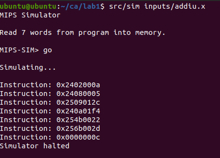

与QtSpim程序单步执行顺序相同。

#### 寄存器对比结果：

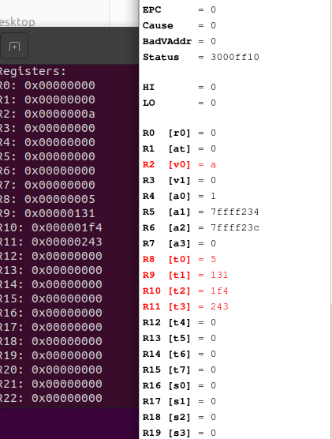

与QtSpim程序执行结果相同。


### arithtest.x

#### 指令执行顺序：

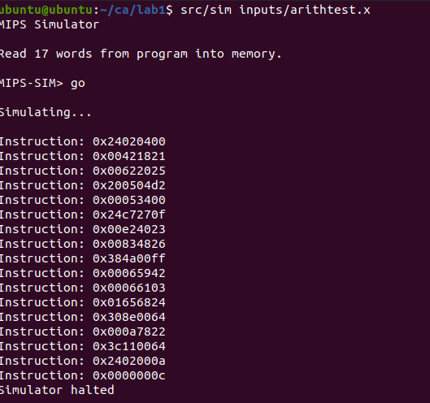

与QtSpim程序单步执行顺序相同。

#### 寄存器对比结果：

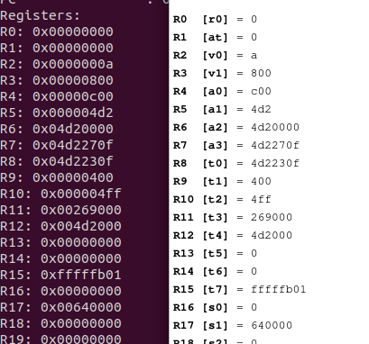

与QtSpim程序执行结果相同。


### brtest0.x

#### 指令执行顺序：

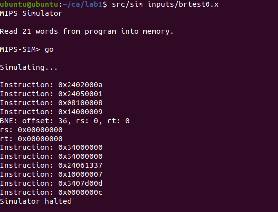

与QtSpim程序单步执行顺序相同。

#### 寄存器对比结果：

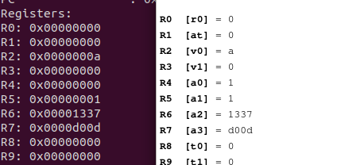

与QtSpim程序执行结果相同。


### brtest1.x

#### 指令执行顺序：

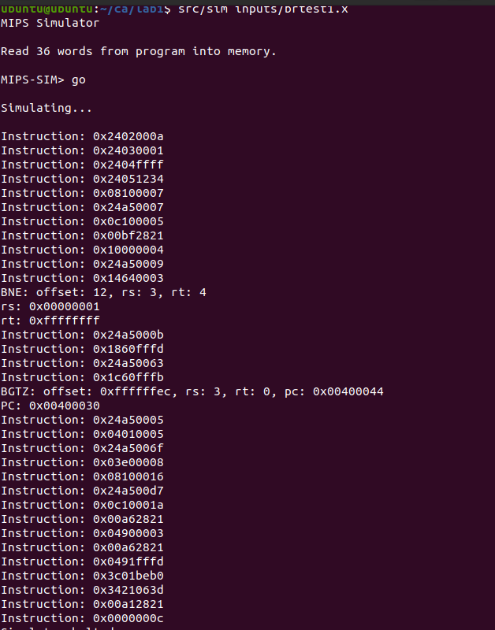

与QtSpim程序单步执行顺序相同。


### brtest2.x

#### 指令执行顺序：

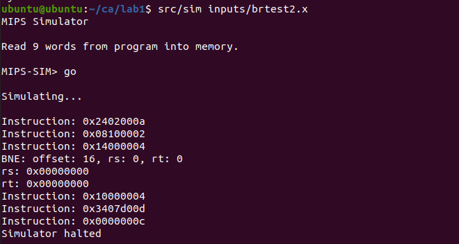

与QtSpim程序单步执行顺序相同。

#### 寄存器对比结果：

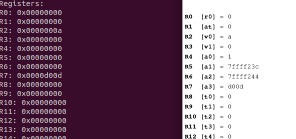

与QtSpim程序执行结果相同。


### memtest0.x

#### 指令执行顺序：

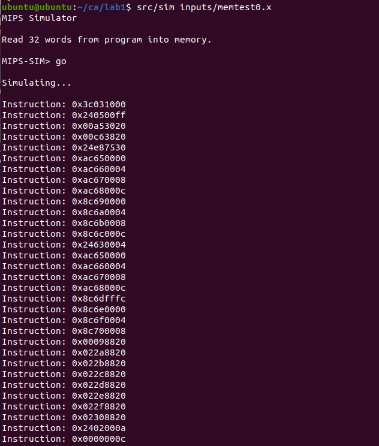

与QtSpim程序单步执行顺序相同。

#### 寄存器对比结果：

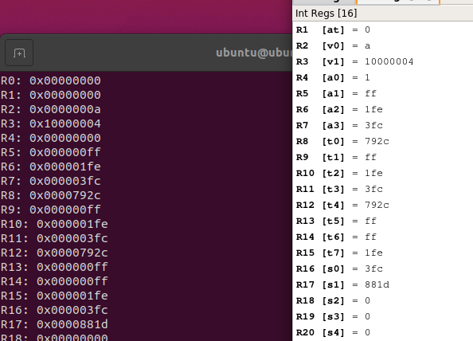

与QtSpim程序执行结果相同。


### mentest1.x

#### 指令执行顺序：

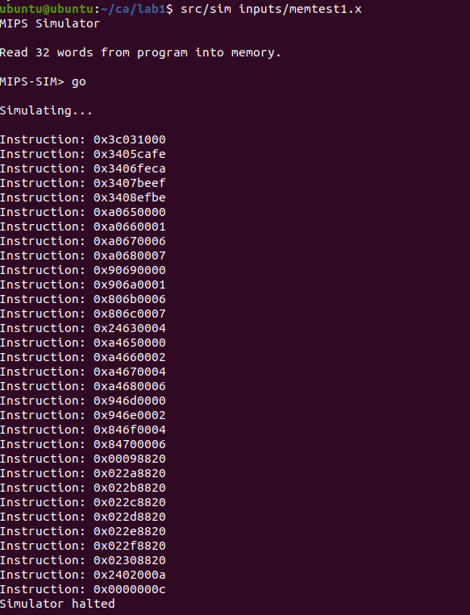

与QtSpim程序单步执行顺序相同。

#### 寄存器对比结果：

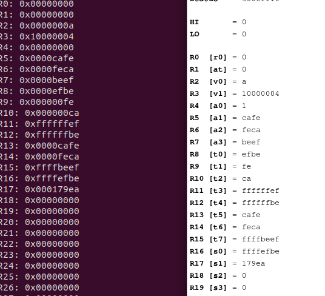

与QtSpim程序执行结果相同。

## 总结

相较于x86指令集，MIPS指令集更加简单易学。学习指令集是深入理解计算机体系结构和计算机编程的关键一步。从查阅资料的过程中，我了解到了MIPS指令集的简洁性和规范性，每个指令都有相对较少的操作码和操作数，这使得它易于理解和实现。尽管指令数量有限，但MIPS提供了丰富的数据处理和控制流操作，使其非常强大。此外，MIPS使用大量寄存器，这些寄存器用于存储数据和地址，减少了内存访问的需求，从而提高了性能。学习如何有效地使用这些寄存器对于我们编写高效的程序至关重要。学习MIPS指令是计算机科学和工程领域的重要一步。它不仅为我们理解计算机底层提供了基础，还为后续学习其他体系结构和编程语言打下了坚实的基础。通过实际编写和调试MIPS汇编代码，我更深刻地理解了计算机的工作原理。

